# MCP Implementation Comparison

Comparison between **Simple (Direct Import)** vs **Proper MCP** implementations.

---

## 📋 Overview

This project includes **two implementations** of the agent orchestrator:

1. **`orchestrator.py`** - Simple implementation using direct imports (demo-friendly)
2. **`orchestrator_proper_mcp.py`** - Proper MCP protocol implementation (production-ready, stdio transport)
3. **`orchestrator_remote_mcp.py`** - YAML-driven variant that connects to remote MCP servers over SSE/HTTP

Both achieve the same goal but with different approaches. This document explains when to use each.

---

## 🔄 Quick Comparison

| Aspect | Simple Implementation | Proper MCP Implementation |
|--------|----------------------|---------------------------|
| **File** | `agent/orchestrator.py` | `agent/orchestrator_proper_mcp.py` / `agent/orchestrator_remote_mcp.py` |
| **Architecture** | Direct function calls | Client/Server protocol (stdio or SSE) |
| **Complexity** | Low ✅ | Medium ⚠️ |
| **Code Style** | Synchronous | Asynchronous (async/await) |
| **Setup** | Single process | Multiple processes |
| **Remote Servers** | Not supported ❌ | Fully supported ✅ |
| **Protocol** | Direct Python import | MCP JSON-RPC over stdio/SSE |
| **Learning Curve** | Beginner-friendly ✅ | Intermediate ⚠️ |
| **Production Ready** | No ❌ | Yes ✅ |
| **Best For** | Demos, tutorials, learning | Production, remote servers |

---

## 📖 Simple Implementation (`orchestrator.py`)

### How It Works

```python
# Direct import - NO protocol communication
from mcp_akademik.server import get_dosen_pembimbing

# Wrap as LangChain tool
tools["get_dosen_pembimbing"] = Tool(
    name="get_dosen_pembimbing",
    func=get_dosen_pembimbing  # Direct function call
)

# Call tool directly
result = get_dosen_pembimbing("Agus Setiawan")
```

### Architecture


### Pros ✅

- **Simple to understand** - No protocol complexity
- **Easy to debug** - Everything in one process
- **Beginner-friendly** - No async/await needed
- **Fast setup** - Just import and run
- **Perfect for demos** - Focus on concepts, not infrastructure

### Cons ❌

- **Not true MCP** - Just "MCP-style" with decorators
- **No remote servers** - Everything must be local
- **Single process** - Can't scale horizontally
- **Not production-ready** - No proper client/server separation

### When to Use

- ✅ Educational demos and tutorials
- ✅ Local development and testing
- ✅ Learning Agentic AI concepts
- ✅ Time-constrained presentations (1-hour webinar)
- ❌ Production deployments
- ❌ Distributed systems
- ❌ Remote MCP servers

---

## 🔌 Proper MCP Implementation (`orchestrator_proper_mcp.py`)

### How It Works

```python
# Connect to MCP server via protocol
server_params = StdioServerParameters(
    command="python",
    args=["mcp_akademik/server.py"]
)

# Establish client/server connection
read, write = await stdio_client(server_params)
session = ClientSession(read, write)
await session.initialize()

# Call tool via MCP protocol (JSON-RPC)
result = await session.call_tool(
    "get_dosen_pembimbing",
    arguments={"nama_mahasiswa": "Agus Setiawan"}
)
```

### Architecture



```mermaid
graph LR
    subgraph ClientProcess["🔷 Agent Orchestrator (Client Process)"]
        Client["MCP Client<br/>Session"]
    end

    subgraph ServerProcess["🔶 MCP Server Process (Akademik)"]
        Server["MCP Server<br/>(FastMCP)"]
        Tools["Tool Functions<br/>@mcp.tool()"]
        Database[("Database<br/>(kampus.db)")]

        Server --> Tools
        Tools --> Database
    end

    Client <-->|"stdio<br/>(JSON-RPC)"| Server

    style ClientProcess fill:#e1f5ff,stroke:#0288d1,stroke-width:3px
    style ServerProcess fill:#fff3e0,stroke:#f57c00,stroke-width:3px
    style Client fill:#64b5f6,stroke:#1976d2,stroke-width:2px
    style Server fill:#ffb74d,stroke:#e65100,stroke-width:2px
    style Tools fill:#c8e6c9,stroke:#388e3c,stroke-width:2px
    style Database fill:#ffccbc,stroke:#d84315,stroke-width:2px
```

**Separate Processes - True client/server architecture**

### Architecture (Remote MCP via SSE)

```mermaid
graph LR
    subgraph Orchestrator["🔷 Agent Orchestrator<br/>(Remote YAML Config)"]
        RemoteClient["MCP Client<br/>Session"]
        Config["mcp_servers.yaml"]
        RemoteClient -->|reads| Config
    end

    subgraph Network["🌐 Network Boundary"]
        subgraph Utilitas["🔶 MCP Utilitas Server (SSE)"]
            UtilServer["FastMCP + SSE"]
            UtilTools["Tools: get_waktu_saat_ini, kalkulator"]
            UtilServer --> UtilTools
        end

        subgraph Akademik["🔶 MCP Akademik Server (SSE)"]
            AkadServer["FastMCP + SSE"]
            AkadTools["Tools: get_dosen_pembimbing, ..."]
            AkadDB[("SQLite<br/>kampus.db")]
            AkadServer --> AkadTools --> AkadDB
        end
    end

    RemoteClient <-->|HTTP/SSE| UtilServer
    RemoteClient <-->|HTTP/SSE| AkadServer

    style Orchestrator fill:#e1f5ff,stroke:#0288d1,stroke-width:3px
    style Network fill:#fff3e0,stroke:#f57c00,stroke-width:3px
    style RemoteClient fill:#64b5f6,stroke:#1976d2,stroke-width:2px
    style Config fill:#bbdefb,stroke:#1976d2,stroke-width:1px
    style UtilServer fill:#ffb74d,stroke:#e65100,stroke-width:2px
    style AkadServer fill:#ffb74d,stroke:#e65100,stroke-width:2px
    style UtilTools fill:#c8e6c9,stroke:#388e3c,stroke-width:2px
    style AkadTools fill:#c8e6c9,stroke:#388e3c,stroke-width:2px
    style AkadDB fill:#ffccbc,stroke:#d84315,stroke-width:2px
```



`agent/orchestrator_remote_mcp.py` loads the YAML file, connects to each SSE endpoint, and registers the advertised tools. Servers can live on the same laptop (e.g., via `./scripts/run_remote_demo.sh`) or on different machines.

### Communication Protocol


### Pros ✅

- **True MCP protocol** - Official standard implementation
- **Remote servers** - Can connect to servers anywhere
- **Scalable** - Multiple processes, horizontal scaling
- **Production-ready** - Proper client/server separation
- **Language-agnostic** - Server can be any language (Python, Node.js, Go, etc.)
- **Multi-client** - Multiple clients can connect to same server
- **Standard protocol** - Follows MCP specification

### Cons ❌

- **More complex** - Requires understanding async/await
- **Harder to debug** - Multiple processes
- **Setup overhead** - Process management required
- **Learning curve** - Not beginner-friendly
- **More dependencies** - Requires `mcp` package

### When to Use

- ✅ Production deployments
- ✅ Remote MCP servers
- ✅ Distributed systems
- ✅ Real-world applications
- ✅ When you need scalability
- ✅ Learning proper MCP protocol
- ❌ Quick demos (too complex)
- ❌ Beginner tutorials (confusing)

---

## 🎓 Educational Perspective

### For Webinar (1-hour demo)

**Recommended:** Use **Simple Implementation** (`orchestrator.py`)

**Why:**
- Focus on **concepts** (Agent, MCP security, RAG)
- Not on **infrastructure** (protocol, async, processes)
- Easier for beginners to understand
- Less time explaining technical details

**Mention:** "In production, you'd use proper MCP protocol" (show slides)

### For Advanced Tutorial

**Recommended:** Show **both implementations** side-by-side

**Progression:**
1. Start with simple version (concepts)
2. Explain limitations
3. Show proper version (production-ready)
4. Highlight differences

### For Production Deployment

**Recommended:** Use **Proper MCP Implementation** only

**Why:**
- True client/server separation
- Supports remote servers
- Scalable architecture
- Standards-compliant

---

## 💻 Code Examples

### Simple: Adding a New Tool

```python
# In mcp_akademik/server.py
@mcp.tool()
def new_tool(param: str) -> str:
    return f"Result: {param}"

# In orchestrator.py
from mcp_akademik.server import new_tool

tools["new_tool"] = Tool(
    name="new_tool",
    func=new_tool
)
```

**Easy!** Just import and wrap. ✅

### Proper MCP: Adding a New Tool

```python
# In mcp_akademik/server.py
@mcp.tool()
def new_tool(param: str) -> str:
    return f"Result: {param}"

# Server automatically registers it!
# No change needed in orchestrator_proper_mcp.py
```

**Even easier!** Auto-discovery via MCP protocol. ✅✅

---

## 🔧 Running Instructions

### Simple Implementation

```bash
# Single command, single process
cd agent
python orchestrator.py
```

**That's it!** 🎉

### Proper MCP Implementation

```bash
# MCP servers run automatically as subprocesses
cd agent
python orchestrator_proper_mcp.py
```

**Also easy!** Servers auto-start via stdio transport. 🎉

---

## 🌐 Remote Server Example (Proper MCP Only)

`agent/orchestrator_remote_mcp.py` plus `agent/mcp_servers.yaml` provide a turnkey way to connect to MCP servers running outside the orchestrator process (local or remote SSE endpoints). This is the setup that powers `./scripts/run_remote_demo.sh`.

### Server (SSE Mode)

```bash
# Utilitas server on port 8081
python mcp_utilitas/server.py --transport sse --host 0.0.0.0 --port 8081

# Akademik server on port 8082
python mcp_akademik/server.py --transport sse --host 0.0.0.0 --port 8082
```

### Client Configuration

```yaml
# agent/mcp_servers.yaml
servers:
  - name: utilitas
    transport: sse
    url: http://10.0.0.12:8081/sse

  - name: akademik
    transport: sse
    url: http://10.0.0.15:8082/sse
```

```bash
export MCP_SERVERS_CONFIG=/path/to/servers.yaml
python scripts/test_remote_mcp.py --query "Jam berapa sekarang?"
```

Need the whole workflow automated? Run:

```bash
./scripts/run_remote_demo.sh --no-rag
```

The script installs dependencies, launches both servers in SSE mode, and drives the remote orchestrator. **None of this is possible with the simple `orchestrator.py` implementation.**

---

## 📊 Performance Comparison

| Metric | Simple | Proper MCP |
|--------|--------|------------|
| **Cold Start** | ~100ms | ~500ms (process spawn) |
| **Query Time** | ~1000ms | ~1050ms (+50ms overhead) |
| **Memory** | Single process | Multiple processes |
| **Scalability** | Limited | Horizontal scaling |

**Conclusion:** Proper MCP has ~5% overhead but gains massive scalability.

---

## 🎯 Recommendations

### Choose Simple If:
- Building a demo or tutorial
- Teaching Agentic AI concepts
- Time-constrained presentation
- Beginner-friendly environment
- Local-only deployment

### Choose Proper MCP If:
- Deploying to production
- Need remote server support
- Building distributed system
- Want true MCP compliance
- Learning proper protocol

### Hybrid Approach (Recommended):
1. **Start with Simple** for learning concepts
2. **Show Proper MCP** as "next step"
3. **Document both** for reference
4. **Let users choose** based on needs

---

## 🔍 Detailed Differences

### Import Statements

**Simple:**
```python
# Direct imports
from mcp_akademik.server import get_dosen_pembimbing
from mcp_utilitas.server import get_waktu_saat_ini
```

**Proper MCP:**
```python
# MCP client imports
from mcp import ClientSession, StdioServerParameters
from mcp.client.stdio import stdio_client
```

### Tool Loading

**Simple:**
```python
# Manual wrapping
tools["get_dosen_pembimbing"] = Tool(
    name="get_dosen_pembimbing",
    description="...",
    func=get_dosen_pembimbing
)
```

**Proper MCP:**
```python
# Auto-discovery via protocol
tools_response = await session.list_tools()
for tool_info in tools_response.tools:
    # Automatically registered!
    tools[tool_info.name] = create_wrapper(tool_info)
```

### Tool Execution

**Simple:**
```python
# Direct function call
result = get_dosen_pembimbing("Agus Setiawan")
```

**Proper MCP:**
```python
# Protocol call via JSON-RPC
result = await session.call_tool(
    "get_dosen_pembimbing",
    arguments={"nama_mahasiswa": "Agus Setiawan"}
)
```

### Error Handling

**Simple:**
```python
try:
    result = tool_func(param)
except Exception as e:
    # Direct exception
    print(f"Error: {e}")
```

**Proper MCP:**
```python
try:
    result = await session.call_tool(...)
except McpError as e:
    # Protocol-level error
    print(f"MCP Error: {e.code} - {e.message}")
except Exception as e:
    # Connection/transport error
    print(f"Error: {e}")
```

---

## 📚 Additional Resources

### Simple Implementation
- File: `agent/orchestrator.py`
- Documentation: `agent/README.md`
- Best for: Beginners, demos, learning

### Proper MCP Implementation
- File: `agent/orchestrator_proper_mcp.py`
- Documentation: This file + MCP spec
- Best for: Production, distributed systems

### MCP Protocol
- Official Spec: https://modelcontextprotocol.io/
- GitHub: https://github.com/modelcontextprotocol
- Discord: MCP community

---

## 🚀 Migration Guide

### From Simple to Proper MCP

**Step 1:** Keep your MCP servers unchanged
```python
# mcp_akademik/server.py stays the same!
# Already has @mcp.tool() decorators
```

**Step 2:** Replace orchestrator
```bash
# Old way
python orchestrator.py

# New way
python orchestrator_proper_mcp.py
```

**Step 3:** Enjoy benefits!
- Remote server support
- Better scalability
- Standard compliance

**No changes to tools needed!** The same `@mcp.tool()` decorated functions work with both. 🎉

---

## ❓ FAQ

### Q: Which should I use for the webinar?

**A:** Use `orchestrator.py` (simple). It's clearer for teaching concepts.

### Q: Can I mix both?

**A:** No, they're mutually exclusive. Choose one per deployment.

### Q: Does proper MCP require rewriting tools?

**A:** No! Tools with `@mcp.tool()` work with both implementations.

### Q: Is proper MCP harder to use?

**A:** Slightly. Main difference: async/await syntax. Same API otherwise.

### Q: When will I need proper MCP?

**A:** When deploying to production or connecting remote servers.

### Q: Can I start simple and migrate later?

**A:** Yes! Migration is easy (see guide above).

---

## 📝 Summary

**Both implementations are valid** and serve different purposes:

- **Simple** = Great for learning and demos
- **Proper MCP** = Great for production and scale

**Start simple, upgrade when needed.** Both are included in this project for educational comparison. 🎓

---

**Questions?** See `agent/README.md` or check the MCP specification at modelcontextprotocol.io
